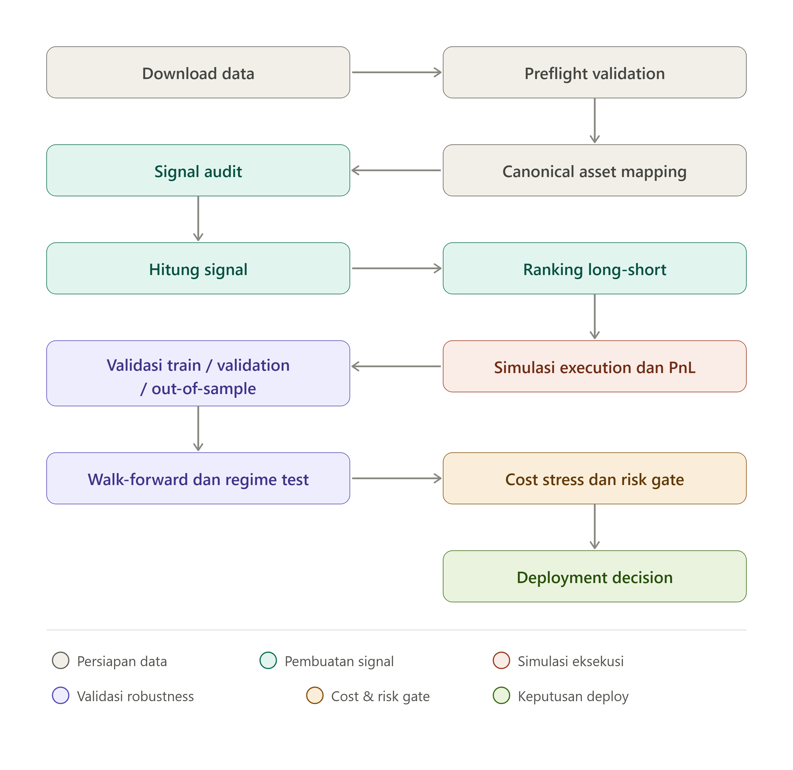

# Crypto Relative-Value Checker

Sistem untuk menguji strategi trading crypto long-short secara hati-hati.

Sistem membandingkan banyak coin pada waktu yang sama. Coin dengan sinyal paling kuat dibeli (**long**). Coin dengan sinyal paling lemah dijual (**short**). Karena posisi long dan short dibuat bersamaan, tujuan strategi adalah mencari perbedaan performa antar-coin, bukan menebak arah seluruh market.

Sistem menghitung:

- PnL dari perubahan harga.
- PnL funding rate futures.
- Fee transaksi (flat atau bertingkat per likuiditas).
- Slippage.
- Turnover dan capacity check.
- Exposure long, short, gross, dan net.
- Sharpe ratio (dengan koreksi multiple-testing).
- Volatilitas dan vol-targeting overlay.
- Maximum drawdown dari equity awal.
- Risk violation (daily loss, max drawdown, capacity, forced exit).
- Performa per rezim market (bull/bear/sideways x high/low vol).
- Benchmark: equal-weight, BTC, ETH, long-only, market-neutral reference.

Sistem **tidak menjamin profit**. `DEPLOYABLE=True` hanya muncul jika 5 hard gate lolos (`wf_positive`, `oos_positive`, `no_risk_violations`, `no_capacity_violations`, `reality_check_pass`). Jangan pernah melonggarkan gate agar hasil menjadi `True`.

## Flow Visual



## Flow Sistem

```text
Download data (klines 1d/4h/1h + funding monthly/API)
    |
    v
Preflight validation (+ universe manifest, delisting suspects)
    |
    v
Canonical asset mapping (+ migration collision check, official price factors)
    |
    v
Signal audit + factor library (15 kandidat)
    |
    v
Ranking long-short (equal weight, vol-targeting, rebalance filter)
    |
    v
Simulasi execution dan PnL (fee/slippage tiered, funding, capacity limit)
    |
    v
Validation train/validation/OOS dengan CONTINUOUS equity
    |
    v
Walk-forward + regime test + reality check (Newey-West, bootstrap, Bonferroni)
    |
    v
Cost stress (multiplier saat tiered) + risk/capacity/spread gate
    |
    v
Deployment decision (fail-closed)
```

## Struktur Proyek

```text
crypto_checker/
  core.py            # mesin backtest: ranking, PnL, fee/slippage, vol-targeting, capacity
  binance_vision.py  # downloader klines 1d/4h/1h + funding (arsip bulanan + fallback API)
  assets.py          # canonical mapping + migration factors + continuity audit
  preflight.py       # validasi dataset sebelum backtest (fail-fast)
  signals.py         # pustaka 15 faktor (momentum, reversal, carry, low-vol, combo z-score)
  signal_audit.py    # cek signal konstan / forward-fill / kumulatif
  research.py        # rank-IC, t-stat, Newey-West, bootstrap CI, quantile return
  reality_check.py   # koreksi multiple-testing (Bonferroni), utilitas statistik
  validation.py      # split train/val/OOS continuous-equity, regime, benchmark, stress
  selection.py       # walk-forward selection bebas leakage
  decision.py        # keputusan deployment gabungan semua gate
  spread_check.py    # ukur spread bid-ask riil dari order book Binance
  cli.py             # command-line interface
scripts/
  download_midcap.py # unduh dataset per sektor (l1_l2, defi, oracle_infra, gaming, meme, legacy, mega)
  download_binance_sample.py
  analyze_midcap.py  # pipeline analisis midcap end-to-end (preflight, spread, signal, WF)
tests/
  test_core.py       # 50 regression test
```

## Instalasi

```bash
python -m pip install -r requirements.txt
```

Dependency: `pandas`, `numpy`, `pytest`.

Jalankan test:

```bash
python -m pytest tests -q
```

## Download Data

Dataset utama (daily 2 tahun, semua sektor + mega-cap sebagai reference):

```bash
python scripts\download_midcap.py ^
  --start 2024-01-01 ^
  --end 2026-08-31 ^
  --interval 1d ^
  --output data\midcap_2y_daily.csv ^
  --sectors l1_l2,defi,oracle_infra,gaming,meme,legacy ^
  --include-mega
```

Interval yang didukung: `1d`, `4h`, `1h`. Untuk `1h`/`4h`, funding di-merge per candle tepat (event funding 8-jam-an menempel pada candle-nya); untuk `1d`, funding harian dijumlah dari 3 settlement. Guard lookahead menolak event yang settle setelah candle close.

Semua annualisasi (Sharpe, volatilitas, annualized return, vol-targeting) memakai `periods_per_year` yang diinferensi dari spasi timestamp — daily→365.0 persis, 4h→2190.0, 1h→8760.0 (bisa dioverride via `CheckerConfig(periods_per_year=...)`, tercatat di tiap ringkasan sebagai `periods_per_year`). Window walk-forward (`min_train_days`/`test_days`) otomatis diskala ke jumlah periode agar artinya tetap "hari" di semua interval.

Aturan funding downloader (fail-closed):

- Bulan lengkap: arsip bulanan Binance Vision.
- Bulan berjalan (arsip belum terbit): fallback API `fapi.binance.com` dengan pagination.
- Keduanya gagal: error eksplisit berisi daftar `(simbol, bulan)` yang hilang + saran (set `--end` ke bulan lengkap terakhir), dan file partial + manifest disimpan di samping output. **Tidak ada funding yang diam-diam diisi nol.**

Downloader mencatat setiap URL (`DOWNLOAD`/`SKIP`) dan simbol yang hilang/rename (mis. MATICUSDT -> POLUSDT) terlihat jelas di log.

### Troubleshooting koneksi Binance

Endpoint `data.binance.vision` dan `fapi.binance.com` kadang timeout / terblokir DNS bawaan ISP. Solusi yang terbukti: ganti DNS ke Cloudflare.

- Preferred DNS: `1.1.1.1`
- Alternate DNS: `1.0.0.1`

Cara (Windows): Settings > Network > adapter aktif > Properties > IPv4 > Use the following DNS server addresses > isi `1.1.1.1` dan `1.0.0.1` > OK, lalu ulangi download. Jika masih gagal, script mencetak `SPREAD_CHECK_UNAVAILABLE` / `SKIP` per file — jangan lanjutkan analisis seolah data lengkap.

## Preflight Validation

Sebelum backtest, `preflight.json` memeriksa: kolom wajib, timestamp UTC, harga positif-finite, signal numerik-finite, funding wajib lengkap (mode futures), `quote_volume` (mode midcap), duplikat, jumlah aset/periode minimum, gap timestamp, diskontinuitas migrasi, dan tabrakan migrasi. Output tambahan:

- `universe_membership`: kehadiran tiap aset per timestamp.
- `asset_status`: first/last seen + status (`active_full_period` / `partial_history_or_delisted`).
- `delisting_suspects`: aset yang berhenti jauh sebelum tanggal akhir — hari terakhirnya wajib diperlakukan sebagai forced exit, bukan dibuang diam-diam.
- `survivorship_note`: universe berasal dari simbol aktif saat ini; tanpa verifikasi membership independen, hasil berpotensi bias survivorship yang belum terukur.
- `lifecycle_manifest`: segmen `listed_at`/`delisted_at` per (canonical, source symbol) — otoritas universe point-in-time (lihat Asset Lifecycle Engine). Tanggal listing yang masih `inferred_from_data` diberi warning eksplisit: ganti dengan tanggal listing resmi sebelum klaim survivorship-free.

Mode eksplorasi `price_only` mentoleransi gap kecil (jadi warning + forced exit di backtest); mode futures menolak gap apa pun.

## Asset Lifecycle Engine (`crypto_checker/lifecycle.py`)

Fondasi universe construction: tiap aset canonical dipecah menjadi segmen `(symbol, listed_at, delisted_at, event, source)`.

- Batas migrasi (GAL→G, MATIC→POL, ...) memakai effective date resmi pengumuman (`source: official`); tanggal listing/delisting sisanya diinferensi dari first/last seen (`source: inferred_from_data` — placeholder, bukan fakta).
- `active_assets(lifecycle, ts)` menjawab "apa yang tradable di instant t" — backtest konsisten dengan ini by construction (ranking hanya memakai aset yang hadir di bar t; tidak ada forward fill).
- `audit_universe_compliance(data, lifecycle)` memeriksa dataset terhadap manifest **independen** (mis. yang dikurasi manual dari tanggal resmi) dan menandai `trading_before_listing` / `trading_after_delisting` / `no_lifecycle_segment`.
- `write/load_lifecycle_manifest` (CSV) untuk kurasi manual: ekspor manifest inferensi sebagai titik awal, koreksi dengan tanggal resmi, lalu audit ulang.

## Canonical Asset Mapping

Token yang pernah ganti nama disatukan agar history tidak pecah. Kolom `source_asset` menyimpan simbol asli untuk audit.

| Legacy | Canonical | Ratio resmi | Effective date (UTC) |
|---|---|---|---|
| GAL | G | 1 GAL = 60 G | 2024-07-19 08:00 |
| OMNI | NOM | 1 OMNI = 75 NOM | 2025-10-01 08:00 |
| MATIC | POL | 1 MATIC = 1 POL | 2024-09-13 10:00 |
| NANO | XNO | 1 NANO = 1 XNO | 2022-01-28 04:00 |
| VEN | VET | 1 VEN = 100 VET | 2018-07-25 04:00 |
| BCC | BCH | (faktor resmi belum terverifikasi) | - |
| ANTOLD | ANT | (faktor resmi belum terverifikasi) | - |

Aturan keras: overlap dua source symbol pada timestamp yang sama (`MIGRATION_COLLISION`) menghentikan run; faktor harga hanya diterapkan sebelum effective date (`adjusted = old_price / ratio`); rasio tanpa sumber resmi tidak ditebak — tetap `None` dan memicu error bila diskontinuitas terdeteksi.

## Signal (15 kandidat, semua point-in-time)

Momentum (skip 1 hari terakhir): `momentum_7/14/30`, `vol_adj_momentum_14/30`. Reversal: `reversal_1`, `resid_reversal_14/30` (residu terhadap beta BTC trailing). Low-vol anomaly: `low_vol_14/30`. Carry/funding: `carry` (-funding), `funding_surprise`, `vol_adj_carry`. Kombinasi z-score cross-sectional: `carry_mom_z`, `carry_lowvol_z`.

Definisi lag tetap: signal candle `t` dipakai untuk posisi periode `t -> t+1`. Tidak ada data masa depan.

Aturan eksekusi tunggal (timestamp = candle OPEN, `price` = close) — **signal(t) dieksekusi di t+1**, dipaksakan untuk SEMUA signal tanpa kecuali:

- Kolom signal yang di-ranking di-shift satu bar per aset SEBELUM smoothing/validasi/ranking, sehingga nilai yang di-ranking di bar `t` hanya memuat info sampai close(t-1) dan diisi di harga close(t).
- Ini menutup lubang lookahead lama: signal custom/kolom default (`signal` = return kontemporer) sebelumnya terisi di close yang sama dengan bar observasinya. Faktor bawaan yang sudah self-lag membayar satu bar lag ekstra sebagai harga aturan seragam — arah yang konservatif.
- Posisi yang diputuskan di `t` diisi di close(t) (`execution_timestamp` selalu satu bar setelah `signal_timestamp`) dan mulai menghasilkan PnL pada pergerakan `t -> t+1`. Tidak ada PnL yang diakru di bar yang informasinya menghasilkan signal. Bar pertama per aset tidak punya signal executable dan dibuang (input butuh ≥2 bar per aset, ditegakkan fail-closed). Ada regression test yang mengunci perilaku ini, termasuk devil's-advocate test bahwa spike signal di `t` baru mengubah posisi di `t+1`.

## Mesin Backtest (core)

- Ranking cross-sectional long top / short bottom, equal weight, gross default 2.0 / net 0.0.
- `signal_lookback` (smoothing per aset), `min_signal_gap` (tahan posisi bila gap ranking tipis), `rebalance_every`.
- Vol-targeting: `vol_target_annual` (0 = mati); skala = min(1, target_harian / realized_30d); masa warm-up tanpa riwayat memakai `vol_warmup_scale` 0.5.
- Biaya masuk (entry) dan rebalance sama-sama dikenakan. Mode flat (`fee_rate`/`slippage_rate`) atau bertingkat per likuiditas (`liquidity_column=quote_volume`, `liquidity_tiers`, `liquidity_lookback`). `cost_multiplier` mengalikan semua biaya (dipakai cost stress).
- Capacity: order di atas `quote_volume x max_volume_participation` dicatat sebagai violation `capacity_limit` (masuk `capacity.csv` + gate). Baris dengan volume invalid dicatat `invalid_liquidity` dan asetnya tidak bisa dipegang.
- Delisting: default `delist_mode="error"` (hard fail bila harga posisi hilang); `"forced_exit"` menutup posisi di harga terakhir (PnL periode terakhir 0, exit tetap kena biaya) dan mencatatnya — dipakai analisis eksplorasi midcap.
- Funding: long membayar bila funding positif (`funding_positive_paid_by_long`, bisa dibalik untuk eksperimen); `require_funding=True` menolak input tanpa kolom funding.
- Risk limit: `daily_loss_limit`, `max_drawdown_limit` diukur dari **running peak** intra-loop (peak diupdate tiap bar, jadi drawdown puncak-ke-lembah yang sebenarnya memicu violation, bukan cuma rugi-dari-awal); `--enforce-risk-limits` menghentikan run saat breach (mode produksi).
- Drawdown metrik dihitung dari equity awal (bukan dari equity berjalan), supaya konsisten dengan tracking intra-loop.

## Validation, Walk-Forward, Reality Check

- Split 60/20/20 dengan **continuous equity**: satu pass penuh, metrik tiap segmen dihitung dari equity awal segmen (`oos return = equity_akhir / equity_awal - 1`), bukan reset modal. Field `continuous_equity: true`.
- Cost stress: mode flat memakai tier absolut (4+5bps s/d 15+40bps); mode tiered memakai multiplier (`cost_x_2.00`, `cost_x_4.00`) supaya stress benar-benar berpengaruh.
- Walk-forward: seleksi signal x n_sides x vol-target hanya dari train tiap fold; test fold beku. `state_policy` terdokumentasi (fresh deployment per fold, khusus seleksi; keputusan live memakai validasi continuous-equity).
- Reality check: tiap baris `factor_ic` memuat `ic_tstat`, `nw_tstat` (Newey-West), bootstrap CI 95%, `adjusted_pvalue` (Bonferroni); gate `best_ic_tstat > 3.0`.
- Deflated Sharpe Ratio (Bailey & de Prado 2014): Sharpe OOS jalur seleksi dikoreksi bias data-mining atas `n_trials` konfigurasi yang dicoba (`walk_forward.json -> data_mining`: `dsr`, `expected_sharpe_null`, varians Sharpe antar-trial). DSR < 0.95 berarti seleksi kemungkinan beruntung — alpha dibunuh. Informasional (belum hard gate); juga tampil di `deployment_decision.json` sebagai `data_mining` + gate info `dsr_above_95`.
- Ensemble signal (`walk_forward(..., ensemble_top_k=k)`): per fold, top-k signal berbeda berdasar train Sharpe (masing-masing di n_sides/vol-target terbaiknya) dirata-bobot-sama di test segment — setara menjalankan tiap member di modal 1/k. Dilaporkan di `walk_forward.json -> ensemble` sebagai **diagnostik saja** (membership-nya sendiri hasil seleksi, jadi bukan estimasi unbiased; tidak pernah masuk vonis deployable). Best-signal walk-forward diperlakukan sebagai *candidate alpha*, bukan final alpha.
- Capacity curve (`crypto_checker/capacity.py::capacity_curve`): backtest diulang di AUM 10k/100k/1M/10M USD; per level dilaporkan return/Sharpe/drawdown, `breach_trades`, `breached_notional`, `max_participation_ratio`, `headroom_multiple` (berapa kali lipat AUM bisa tumbuh sebelum breach pertama; <1 = sudah breach). Tanpa kolom volume → `status: no_liquidity_data` (menolak mengarang likuiditas).
- Benchmark OOS: equal-weight basket, `btc_buy_hold`, `eth_buy_hold`, long-only equal-weight (jujur, tanpa clip), market-neutral reference. (Versi lama mem-`clip` return negatif harian ke 0 — return fabrikasi yang mustahil dicapai portfolio long-only; sudah diperbaiki.)
- Regime dari BTC 30-hari: bull/bear/sideways x hi/lo vol, dengan cutoff vol memakai **expanding quantile** (hanya data sampai waktu itu — kuantil full-sample sebelumnya membocorkan info masa depan ke label masa lalu).

## Spread Check

```bash
python -c "from crypto_checker.spread_check import check_order_book_spread; check_order_book_spread(['BTCUSDT','INJUSDT'], output='data/spread.csv')"
```

Mengukur spread bid-ask riil (bps) dan menyimpan CSV. Hasil terukur (snapshot): median ~2.3 bps, maks ~16 bps (DYDX saat volatil); tier bawah midcap (5+40 bps) konservatif ~11x di atas median spread tier bawah. Catatan: snapshot kondisi tenang — stress 2x/4x menutupi pelebaran saat krisis. Mode `slippage-mode="spread"` memakai `max(full spread terukur, floor tier)` per aset (fail-closed bila file hilang); flag `--spread-csv` menunjuk ke file spread. Simbol hilang dari bookTicker (mis. delisted) dilaporkan eksplisit. Jika API tidak terjangkau, hasil `SPREAD_CHECK_UNAVAILABLE` dan analisis otomatis turun ke mode eksplorasi (tidak deployable).

## Analisis Midcap End-to-End

```bash
python scripts\analyze_midcap.py ^
  --input data\midcap_2y_daily.csv ^
  --output reports\midcap_2y_daily ^
  --require-funding ^
  --interval 1d
```

Tanpa `--require-funding` (dataset partial tanpa funding), script berjalan mode `price_only` eksplorasi dengan forced exit — valid untuk riset IC, **tidak valid** untuk keputusan futures. Script menguji `low_vol_14/30`, `reversal_1`, `resid_reversal_14/30` dengan cost midcap + walk-forward, lalu menulis `analysis_summary.json` berisi mode, manifest universe, forced-exit assets, preflight, status spread, dan keputusan deploy.

## Menjalankan Checker Manual

```bash
python -m crypto_checker.cli ^
  --input data\midcap_2y_daily.csv ^
  --output reports\midcap_low_vol_30 ^
  --signal low_vol_30 --n-long 3 --n-short 3 ^
  --liquidity-column quote_volume --cost-preset midcap
```

Opsi penting: `--signal` (kolom signal), `--signal-lookback`, `--min-signal-gap`, `--enforce-risk-limits`, `--liquidity-column`, `--cost-preset {liquid,midcap}`, `--slippage-mode {tier,spread}`, `--spread-csv` (wajib bila mode spread), `--research` (pipeline riset penuh + deployment decision), `--skip-walk-forward`. Tier midcap: fee 5 bps flat + slippage 5/10/20/40 bps per persentil volume; tiap segmen validasi menandai `turnover_flag: OVER` bila turnover rata-rata >0,15/hari.

## Membaca Hasil

- `summary.json`: return, Sharpe, volatilitas, max drawdown, turnover, fee, slippage, funding PnL, capacity violations.
- `validation.json`: performa train/val/OOS (continuous), violations, cost stress, benchmark, regime, gates, `deployable`.
- `walk_forward/walk_forward.json`: pilihan per fold, return agregat, stress, gates, `data_mining` (DSR), `ensemble` (bila diminta).
- `capacity_curve.json` (bila dijalankan): kelayakan strategi per level AUM.
- `lifecycle_manifest.csv` (via `write_lifecycle_manifest`): segmen universe untuk kurasi manual.
- `analysis_summary.json` (analyze_midcap): mode, manifest, forced exits, status spread.

## Arti DEPLOYABLE

`DEPLOYABLE=True` berarti lolos semua gate, **bukan** jaminan profit. Vonis hanya memakai 5 hard gate — `wf_positive`, `oos_positive`, `no_risk_violations`, `no_capacity_violations`, `reality_check_pass` (IC terbaik lolos koreksi multiple-testing) — gate lain informasional. Satu hard gate gagal -> `DEPLOYABLE False`.

## Batasan

- Backtest bukan jaminan profit live; hasil OOS bisa kena regime shift.
- Universe berpotensi bias survivorship (tercatat di setiap report).
- Snapshot spread bukan kondisi stress; slippage real-time bisa lebih besar.
- Migration tanpa faktor resmi ditolak — jangan menebak rasio.
- Paper trading 60-90 hari + kill switch + rekonsiliasi order tetap wajib sebelum modal nyata.
